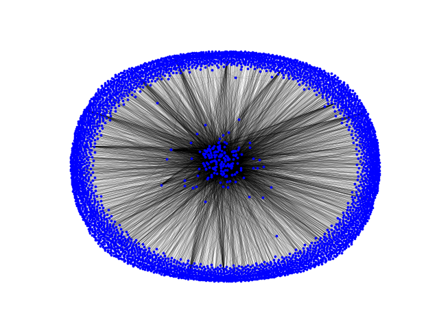

# Webscraper assignment 6
This is a Python course assignment, where i had to create a webscraper,
which should, go to given url and find all links pointing out, and scrape them as well,
in a specified depth.

## Requirements 
- Anacondas python
- networkx
    - install with following command : `$conda install networkx` 

## How to run
To run the CLI program go to root of project and run following command:
- `$python main.py <url>` (default depth is 0)
- `$python main.py <url> <depth>` (depth is very exponential)

        example:
        `$python main.py http://www.pyregex.com 2`
    

## Results
With url= http://www.pyregex.com and depth = 2 , there is scraped 206 links
The graph : 
